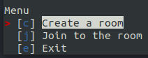
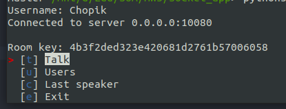
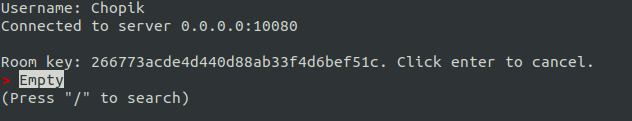
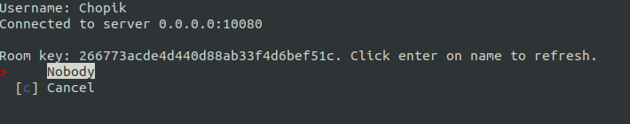
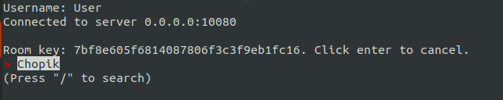
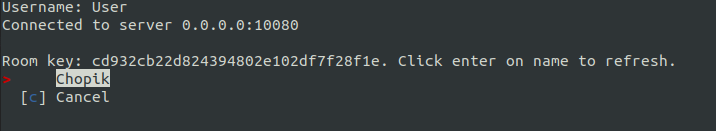
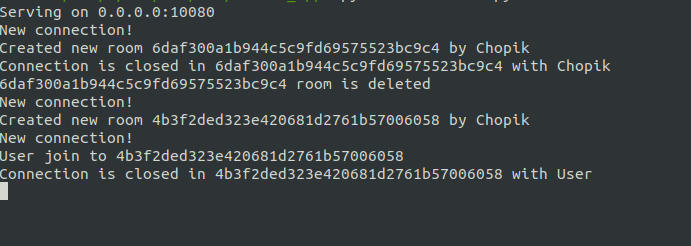

# Socket voice chat

This is simple voice chat on TCP socket. Whole installation under python3.9. You can install it in Ubuntu/Debian using `make install_python3.9`.

### Install dependencies for Linux/Debian
```bash
sudo make apt_get
```

### Install wheel
```bash
sudo make install
```
When you install wheel you can use binaries of client and server:
```bash
socket-voice-chat-client --host 0.0.0.0 --port 10080 --username name
```

```bash
socket-voice-chat-server --host 0.0.0.0 --port 10080
```

### Run client and server directly
```bash
sudo make requirements
RUN_ARGS="--host 0.0.0.0 --port 10080" make server
RUN_ARGS="--host 0.0.0.0 --port 10080 --username name" make client
```

### Docker image of server
```bash
docker run -p 10080:10080 --rm -it ch0p1k/sockets --host 0.0.0.0 --port 10080
```
To run in backend process - add `-d` flag

### Client screenshots







### Server screenshot

